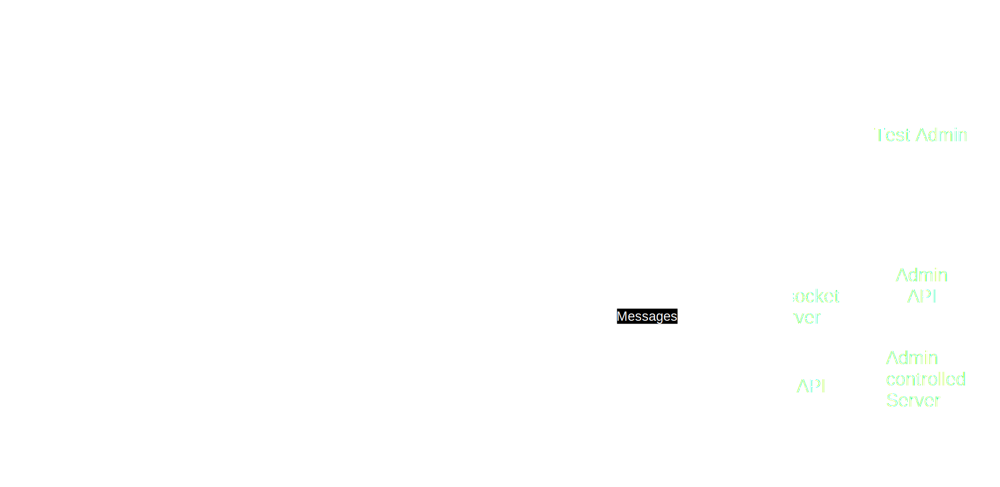

# Gravishken
Gravishken is an automated examination application designed for efficient and flexible evaluations of Microsoft Word and other Office tools. The system leverages Golang, React, Webview, and WebSockets to provide a seamless interface for users to initiate and monitor document-based examinations, manage test configurations, and submit results securely.

# Architecture Overview

- Frontend (React Application): A React-based web application embedded within a native window using Webview. This user interface (UI) enables users to initiate examinations, view real-time results, and configure examination parameters.
- Backend (Golang Application): The Golang backend orchestrates the examination process. It interacts with Office tools (like Microsoft Word) through automation protocols to manipulate documents, apply examination criteria, and log results. The backend also maintains real-time communication with the frontend using WebSocket.
- External Server (Authentication & Results Management): An external server is responsible for handling user authentication, secure access control, and storing examination results. Once an examination is complete, the backend submits results, logs, and other data to the external server.
- Webview (Golang-based Launcher): Webview is used to launch the frontend application within a native window, providing a lightweight desktop experience. It enables communication between the UI and backend via WebSockets and exposed APIs.
- Microsoft Office Tools (MS Word, Excel, etc.): The backend interacts with Microsoft Office tools (e.g., Word, Excel) via automation protocols like COM, allowing the application to manipulate documents and apply examination scenarios.
- WebSocket Communication: Real-time updates during the examination process are sent from the backend to the frontend using WebSockets, enabling live feedback, such as progress updates and results.

## Prerequisites
- Go
  - mingw (for Windows)
    - https://scoop.sh/
    - scoop install mingw
- Bun (or Node.js)
- Rust
- nsis (for creating a windows setup for the app)
  - https://nsis.sourceforge.io/Main_Page

## Additional dependencies
- linux:
  - pkg-config
  - webkit2gtk-4.1
  - Xtst
- windows:
  - pkg-config
  - mingw
  - git bash

### command to install webkit on fedora
```bash
sudo dnf install webkit2gtk3-devel libXtst-devel
```

## Packaging the application
- windows (application):
  - the end user's system must have WebView2.dll (better to ship it with the application. In the same directory as the application)
  - the end user's system must have urita.dll in the same directory as the application
  - an additional `.env` file can be placed in the application directory to override variables
    - SERVER_URL: the uri of the server
    - SERVER_SECURE: set to `true` if the server is secured with SSL/TLS
  - additional notes for `build-windows-installer` command
    - you can create a `.env` file in `./build/.env` which will be shipped to the user
    - a `.env` is also read from `~/AppData/Roaming/Gravishken`
- linux (server):
  - must ship a .env with the following variables:
    - SERVER_URL: the uri of the server
    - MONGODB_URI: the uri of the mongodb server
    - DB_NAME: the name of the database
    - CORS_ALLOW_ORIGINS: the origins that are allowed to access the server

## Setup
```bash
./run.sh setup
```

## Build urita
```bash
./run.sh build-urita
```

## Run Vite for frontend
```bash
./run.sh web-dev
```

## Run backend
```bash
./run.sh server
```

## Run application
```bash
./run.sh app
```

## Building
```bash
# for windows (git bash)
./run.sh build-windows-app
./run.sh build-windows-server
./run.sh build-windows-installer

# for linux
./run.sh build-app
./run.sh build-server
```

## Cross-compiling for Windows from Linux
first you need a working cross compiler setup. one example of how to do this is in flake.nix.

```bash
nix develop .#windows -c run build-windows-app
nix develop .#windows -c run build-windows-installer
nix develop .#windows -c run build-windows-server
```
